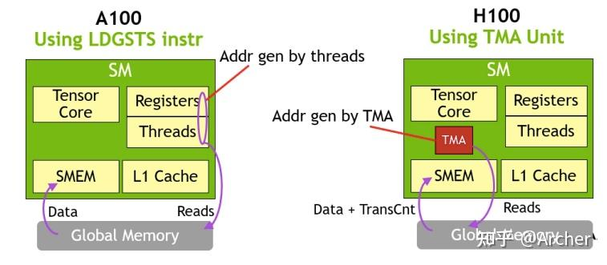

# TMA



TMA是一个异步的地址计算单元。对比于A100， thread 在这个时刻可以转去做其他工作。 而A100需要计算繁琐的global memory 地址， 占用宝贵的register 资源。 这里的TMA很好的被其他计算任务掩藏

https://zhuanlan.zhihu.com/p/601204275


```CPP
template <typename T>
CUtensorMap make_2d_tma_copy_desc(T* global_address, uint64_t gmem_dim[2],
                                  uint64_t stride_in_bytes, uint32_t smem_dim[2],
                                  CUtensorMapSwizzle swizzle_type,
                                  PFN_cuTensorMapEncodeTiled encode_func = nullptr) {
    CUtensorMap tensor_map{};
    constexpr uint32_t rank = 2;
    uint64_t global_stride[rank - 1] = {stride_in_bytes};
    uint32_t elem_strides[rank] = {1, 1};

    if (encode_func == nullptr)
        encode_func = get_cuTensorMapEncodeTiled();

    auto result = encode_func(
            &tensor_map, get_CUtensorMapDataType<typename std::remove_cv<T>::type>(), rank,
            global_address, gmem_dim, global_stride, smem_dim, elem_strides,
            CUtensorMapInterleave::CU_TENSOR_MAP_INTERLEAVE_NONE, swizzle_type,
            CUtensorMapL2promotion::CU_TENSOR_MAP_L2_PROMOTION_L2_256B,
            CUtensorMapFloatOOBfill::CU_TENSOR_MAP_FLOAT_OOB_FILL_NONE);
    DG_HOST_ASSERT(result == CUDA_SUCCESS);
    return tensor_map;
}

```


在这个代码片段中，定义了一个模板函数 `make_2d_tma_copy_desc`，用于创建一个二维 TMA（Tensor Memory Access）复制描述符。这个函数的作用是配置和初始化一个 `CUtensorMap` 对象，该对象用于描述如何在全局内存和共享内存之间进行高效的数据传输。

以下是代码的详细解释：

```cuda-cpp
template <typename T>
CUtensorMap make_2d_tma_copy_desc(T* global_address, uint64_t gmem_dim[2],
                                  uint64_t stride_in_bytes, uint32_t smem_dim[2],
                                  CUtensorMapSwizzle swizzle_type,
                                  PFN_cuTensorMapEncodeTiled encode_func = nullptr) {
    CUtensorMap tensor_map{};
    constexpr uint32_t rank = 2;
    uint64_t global_stride[rank - 1] = {stride_in_bytes};
    uint32_t elem_strides[rank] = {1, 1};

    if (encode_func == nullptr)
        encode_func = get_cuTensorMapEncodeTiled();

    auto result = encode_func(
            &tensor_map, get_CUtensorMapDataType<typename std::remove_cv<T>::type>(), rank,
            global_address, gmem_dim, global_stride, smem_dim, elem_strides,
            CUtensorMapInterleave::CU_TENSOR_MAP_INTERLEAVE_NONE, swizzle_type,
            CUtensorMapL2promotion::CU_TENSOR_MAP_L2_PROMOTION_L2_256B,
            CUtensorMapFloatOOBfill::CU_TENSOR_MAP_FLOAT_OOB_FILL_NONE);
    DG_HOST_ASSERT(result == CUDA_SUCCESS);
    return tensor_map;
}
```

### 参数解释
- `T* global_address`: 指向全局内存中数据的指针。
- `uint64_t gmem_dim[2]`: 全局内存中数据的维度。
- `uint64_t stride_in_bytes`: 全局内存中数据的步长（以字节为单位）。
- `uint32_t smem_dim[2]`: 共享内存中数据的维度。
- `CUtensorMapSwizzle swizzle_type`: 数据排列方式。
- `PFN_cuTensorMapEncodeTiled encode_func`: 用于编码 TMA 描述符的函数指针，默认为 `nullptr`。

### 函数步骤
1. 初始化一个空的 `CUtensorMap` 对象。
2. 定义 `rank` 为 2，表示二维数据。
3. 设置全局内存的步长和元素步长。
4. 如果 `encode_func` 为 `nullptr`，则调用 `get_cuTensorMapEncodeTiled` 获取默认的编码函数。
5. 调用 `encode_func` 函数来配置 `tensor_map`，包括数据类型、维度、地址、步长、排列方式等。
6. 使用 `DG_HOST_ASSERT` 确保编码函数执行成功。
7. 返回配置好的 `tensor_map` 对象。

这个函数的主要目的是为高效的数据传输创建一个描述符，以便在 CUDA 内核中使用 TMA 进行数据传输。